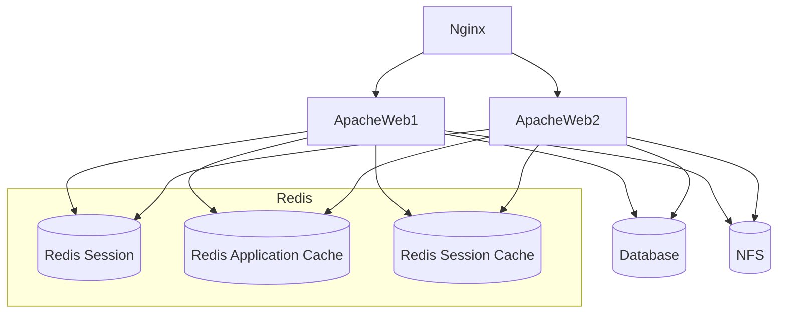
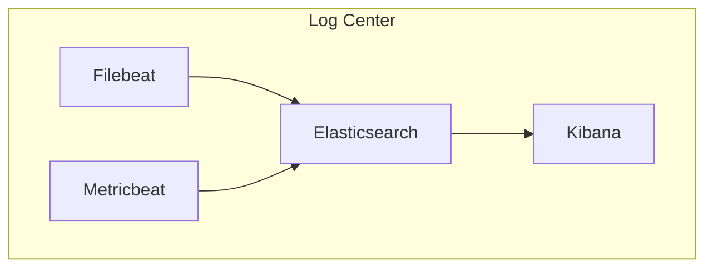
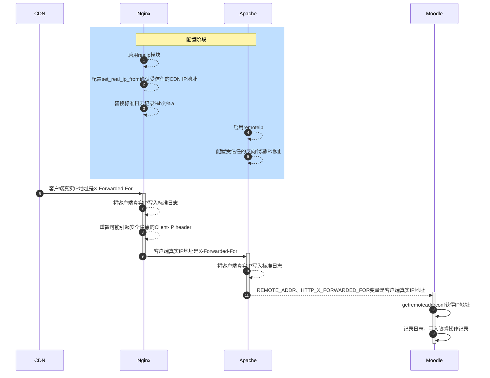
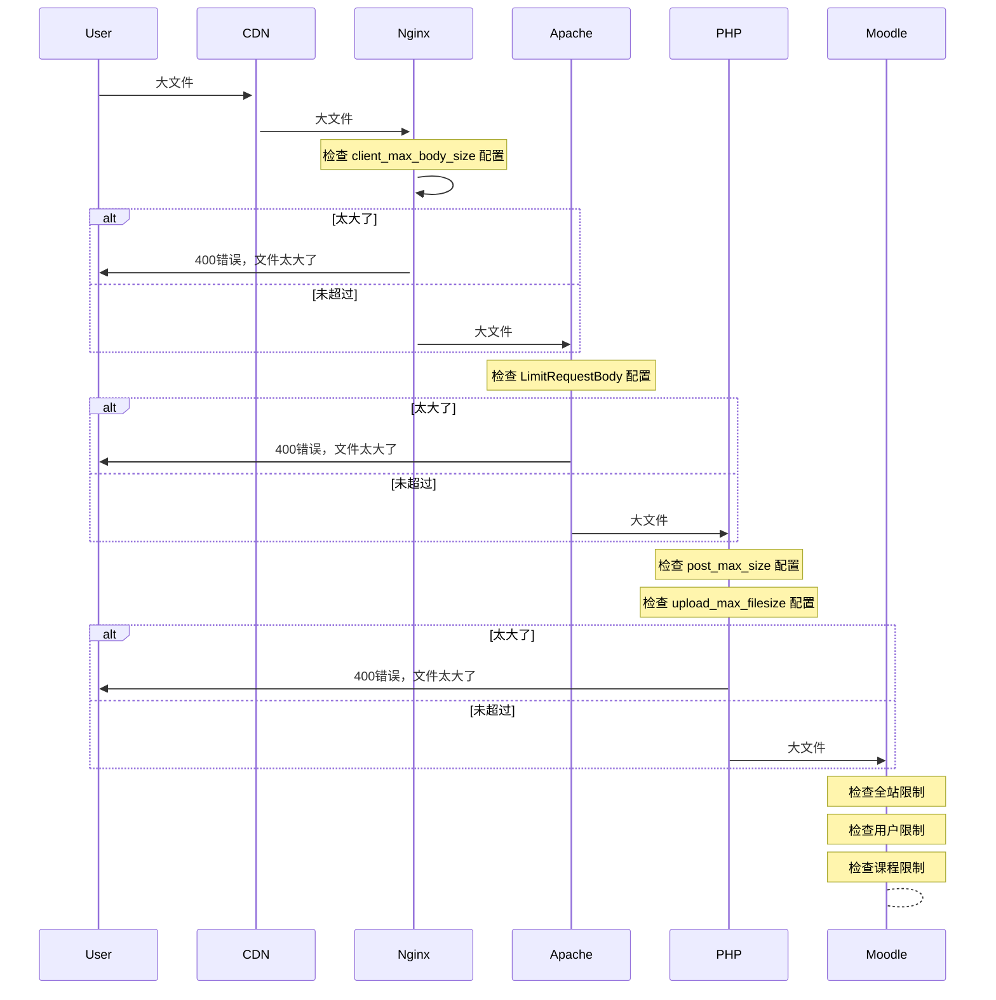

我已经四五年没有碰Moodle了，最近又折腾了下。

本文在实施总结中得到了包括但不止于洪江民、陈晓亮、马鲁伟、萧德洪等人的帮忙。

## 什么是Moodle

> Moodle是开源及自由的电子学习软件平台，亦称为课程管理系统、学习管理系统或虚拟学习环境。
>
> Moodle is a learning platform designed to provide educators, administrators and learners with a single robust, secure and integrated system to create personalised learning environments. Moodle provides the most flexible tool-set to support both blended learning and 100% online courses.

Moodle主要可提供上传课件，布置作业和论坛交流，类似的平台你们可能听过Blackboard，Sakai、Canvas等等。

我原先是在2.x时代接触的Moodle，在我快要不管Moodle的时候，3.x正在重写，那时候很期待，但是功能很多很不完善，最近短时间对Moodle不太深入的了解，个人感觉Moodle已经进化太大了。包括对缓存的处理，HTML输出缓存和分布式部署等等。

本文建议跟《[高校外包公司自动化部署生存指南](https://dog.xmu.edu.cn/2020/02/21/outsource-devops.html)》一起服用效果更佳。

## 我开源了什么

我将我安装的分布式自动化部署代码发布在 [https://github.com/haishanzheng/moodle-deployments](https://github.com/haishanzheng/moodle-deployments)，这个源代码只是参考，**不是**完全可直接运行的版本。我删除了部分过于定制的内容，里面会有很多错误，**请帮忙审计，如果你发现问题或者有更好的实现方法，请一定记得告诉我。如果觉得好用，请Star，我会根据是否有人在使用考虑是否持续更新。**

代码包括什么？

- 多个开源软件的自动化部署和配置调优代码，25个安装包，235个task，73个配置项修改。
- 由于性能压力暂时未测试，所以MySQL没有使用Galera Cluster for MySQL分布式部署，NFS没有使用GlusterFS分布式文件系统替换。

涉及到的开源软件包括

- 操作系统Ubuntu 18.04 LTS
- Web应用服务器Nginx、Apache2
- PHP7.2 FPM
- MySQL；Redis；NFS
- Moodle
- Elack Stack：Elasticsearch、Kibana、Filebeat、Metricbeat
- Zabbix agent
- 自动化部署工具Ansible

最终的架构图如下：





基本上就是，你准备9台Ubuntu 18.04服务器，Git Clone下来代码，配置一下自定义的变量，跑一个命令，就自动部署好以上所有开源软件并做好所有安全加固和性能调优。并且你有一个日志中心和性能仪表盘。

为什么要自动化部署？因为服务器实在太多，比如面对10台Web，常规的手动部署容易出错，防火墙或者PHP配置被人改了会忘记改回来，这得采用自动化部署来确保。自动化部署也方便今后升级，方便对代码进行共享和审计。

所有的配置修改都以Ansible的lineinfile替换，不采用整个配置文件替换的方法，这样子对版本升级是友好的。如果类似Apache有自带site-enabled或者conf.d的目录，尽量将修改的配置放到conf.d自动引入全局配置。一切尽量遵守最佳实践，不污染配置文件。

## 操作系统Ubuntu

操作系统层面的配置和加固，包括引入部署变量，使用ufw防火墙，手动更新到最新，日志和性能数据全部传输到Elastic Stack，引入Zabbix代理监控。

## Nginx

Nginx作为最前端，包括配置加固，禁用不必要的模块，加入Nginx性能汇报，CDN信任IP，Nginx日志和性能全部传输到Elastic Stack。日志保留180天，静态资源缓存配置，SSL配置。客户端IP获取安全配置。

## Apache2、PHP FPM、Moodle

Apache2配置加固，禁用不必要的模块和配置，安装Moodle需要的PHP模块，更改使用PHP FPM模式，mpm_event，对连接数进行调优，客户端IP获取。配置NFS客户端，自动下载Moodle解压，配置Moodle config.php文件。

## MySQL、Redis、NFS

自动安装多个以上包，修改配置。对MySQL针对性调优，配置GTID binlog，开设Moodle数据库和用户。

## Elack Stack

配置调优。

## 客户端IP获取安全配置

由于经过了多个转发，所以最终的PHP获取IP地址就存在问题，因为我们前面起了CDN，再到Nginx，再到Apache，最终Moodle的PHP代码获取客户端IP地址并记录。而Nginx和Apache的Log也需要记录真实客户端IP地址，所以做了以下设置：



注意：Moodle代码使用getremoteaddrconf配置获取客户端IP地址，获取的顺序为HTTP_CLIENT_IP, HTTP_X_FORWARDED_FOR, REMOTE_ADDR，这里有一个坑，HTTP_CLIENT_IP实际上未在HTTP正式协议中出现过，所以反向代理一般很少处理这个字段，所以如果Moodle默认从HTTP_CLIENT_IP这里获取客户端IP地址，而且Nginx或者Apache没有对其进行重置的话，客户端IP很容易被伪造。所以一个解决方法是在Nginx或者Apache里去掉这个头部，或者将Moodle getremoteaddrconf顺序改为HTTP_X_FORWARDED_FOR, REMOTE_ADDR。

## 上传文件大小限制

分布式部署后，从用户上传文件到最终写入NFS磁盘，文件上传的大小限制在多个地方存在，比如




如果遇到上传限制，一定要定位出是哪个地方限制并做相应修改。

## Moodle

Moodle本身对于静态资源的版本化做得非常完善，所以一定要有一台Nginx在前端拦截缓存静态资源，这样子可以大大减轻后端Web的压力。

Moodle的Cache机制也非常完善，包括了应用级、会话级和请求级的缓存，三台Redis分别使用在应用级和会话级缓存和Session同步里。请求级缓存直接使用Web应用服务器本机内存。如果Nginx可以保证同一个IP一定可以引流到同一台Web应用服务器并且不考虑应用服务器动态上下线和重启问题，可以考虑将Session和会话级缓存都做在本机。

Moodle的Log非常得详细，涵盖了用户在Moodle平台的所有操作，在我们的一个部署环境内，mdl_logstore_standard_log 4年下来有40G的大小。这些日志记录可以精确地还原一个用户在Moodle上的所有包括登录，进入哪个地址，下载了什么内容，结合最终成绩的大数据分析非常有意义。未来有机会，可以将mdl_logstore_standard_log扔到ELK来简单分析。Moodle也支持将日志扔到另外一个独立的数据库，这个目前我还在研究，如果可用，将可大大减轻主数据库的压力。

## Web代码同步方法

因为Web有多台，所以需要指定其中一台Web为调试服务器，调试管理员IP永远被导流到这台，Moodle安装插件等先将文件放到这台再同步再所有Web。

Nginx配置：

```conf
    if ( $remote_addr ~* 我的IP ) {
        proxy_pass http://Hserver;
    }
```

## 测试环境同步

因为自动化部署很容易建立环境，所以我们建立了包括正式和测试2个环境，并再写了一个自动化部署脚本用于从正式环境向测试环境导入数据库和NFS文件，实现一键即可将正式环境所有数据导入测试环境。

## 分析工具

涉及到十几台服务器，二十几个开源软件，如果没有统一的监控和日志收集，查错和性能调优将变得异常麻烦，得益于Elastic Stack，我上次碰ELK还是5.x的版本。新版做了非常多优化，基本上是一个开箱即用的日志中心和日志分析工具，

以下是整个ELK架构输出的各种仪表盘，基本上是0配置的。

### 图 仪表盘


### 图 系统


### 图 系统2


### 图 Nginx


### 图 Apache


### 图 MySQL


### 图 Redis


### 图 Redis2


